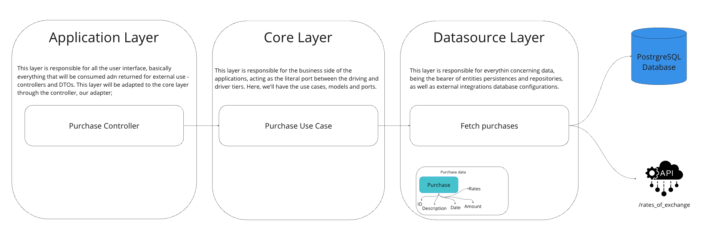
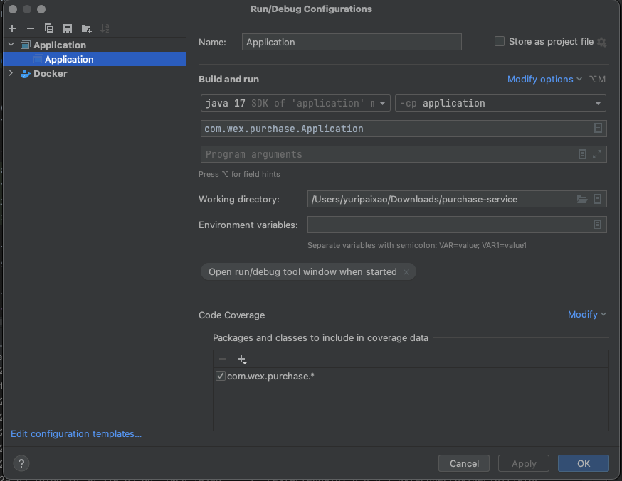

# Purchase Service


This is a GraphQL API, made with Java 17 and Spring Boot 3, that has as its goal is to manage purchases and expose required data.

## Table of Contents
* [Explaining The Architecture](#architecture)
* [How To Run The Project](#run)
  * [Deploy Docker Database Container](#docker)
  * [Maven & Java](#maven-java)
  * [Test The Application](#test)
* [Explaining The Mutations and Queries](#mutations-and-queries)
  * [Mutations](#mutations)
    * [insertPurchase](#insertPurchase)
  * [Queries](#queries)
    * [findPurchase](#findPurchase)

* [Conclusion And Final Considerations](#conclusion)

<a id="architecture"></a>
## Explaining The Architecture

This project was made using a Hexagonal type architecture. What this means is that the project is 
separated by modules and each module deals with a different concern that's unique to them, as well 
as their access level.

When it comes to dependencies and plugins, the Hexagonal architecture is extremely useful, given 
that you can inject dependencies, plugins and other needed tools *only* in the modules that actually 
need them.
* The Application layer concerns everything that is going to be consumed (and visible) to the user - from controllers and models to error messages and docs (as well as configurations needed);
* The Core layer concerns business rules, validations and exceptions, being the connection between the user interactions and the data to be consumed;
* The Datasource layer concerns quite literally, the data that will be consumed - be it from a database or any external connection (in this particular case, the [Treasury Reporting Rates of Exchange API](https://fiscaldata.treasury.gov/datasets/treasury-reporting-rates-exchange/treasury-reporting-rates-of-exchange)).



<sub>Visual representation of the Hexagonal Architecture</sub>

<a id="run"></a>
## How To Run The Project

This is a Java 21 and Spring Boot 3 based project, that uses Maven as it's build automation tool,
and has a dockerized container to run the database, 

That being said, in order to successfully run this application you'll need:
* Java 17
* Maven
* Docker

<a id="docker"></a>
### Deploy Docker Database Container
All you need to do to have the container successfully deployed is enter the 
following commands on a terminal of your choice:

```shell
cd docker
docker-compose up -d
```

<a id="maven-java"></a>
### Maven & Java
If you have a IDE with a configured Java/Maven workspace, all you need to do is
make sure your Run/Debug configuration classpath is pointing to the Application
module.


<sub>In this example, I'm using the Intellij IDEA IDE.</sub>

If you don't have an IDE configured, you can use the following commands in your
terminal:

```shell
mvn clean
mvn install
cd application/
mvn spring-boot:run
```
<sub>note: Make sure you navigate to the application module before running spring boot.</sub>

<a id="test"></a>
### Test The Application

If you followed the steps above correctly, you'll be able to access the GraphQL
playground locally through [http://localhost:8080/playground](http://localhost:8080/playground) :tada:

<a id="mutations-and-queries"></a>
## Explaining The Mutations and Queries
<a id="mutations"></a>
### Mutations
___
<a id="insertPurchase"></a>
#### insertPurchase
**Receives**: a Purchase transaction with a description, transaction date, and a purchase amount in United States dollars.
<br />

**Sample request**
```graphql
mutation {
  insertPurchaseTransaction(purchase:{
    description: "First transaction",
    amount: 2.42,
    transactionDate: "2024-03-16"
  }) {
    id, 
    description, 
    amount, 
    transactionDate
  }
}
```
**Returns**: a purchase transaction with a description, transaction date, and a purchase amount in United States dollars.

**Sample response**
```json
{
  "data": {
    "insertPurchaseTransaction": {
      "id": "2",
      "description": "First transaction",
      "amount": 2.42,
      "transactionDate": "2024-03-16"
    }
  }
}
```
___
<a id="queries"></a>
### Queries
___
<a id="findPurchase"></a>
#### findPurchase
**Receives**: the purchase transaction ID.

**Sample request**
```graphql
query {
  findPurchase(purchaseId: 1){
    id, 
    description, 
    transactionDate, 
    amount,
    convertedCurrencies
  }
}
```
**Returns** the stored purchase transactions converted to currencies supported by the Treasury Reporting Rates of Exchange API based
upon the exchange rate active for the date of the purchase.
**Sample response**
```json
{
  "data": {
    "findPurchase": {
      "id": "2",
      "description": "primeira transacao",
      "transactionDate": "2024-03-16",
      "amount": 2.42,
      "convertedCurrencies": "{Dirham=8.88, Maloti=44.59, Taka=273.46, Dong=58709.20, Dollar=16.33, Zloty=9.49, Rufiyaa=37.31, Manat=4.11, RTGS=19658.45, Quentzal=18.91, Escudo=241.39, Sudanese Pound=3467.86, E. Caribbean Dollar=6.53, Kwacha=4114.00, Kina=9.01, CFA Franc=1425.38, Peso=2245.03, Shilling=325.49, Tugrik=8253.86, Kwanza=2038.85, Riyal=9.07, Riel=9803.42, Real=11.74, Cedi=28.79, Lev New=4.28, Gourde=317.57, Boliviano=16.60, Ruble=215.54, Renminbi=17.19, Vatu=280.72, Somoni=26.45, Ringgit=11.10, Ouguiya=94.76, Lari=6.44, Krone=24.60, Metical=153.06, Euro=2.19, Krona=24.27, Chavito=2.42, Guarani=17544.97, Kip=49551.92, Denar=134.18, Baht=83.07, Dinar=7.41, Pa'anga=5.46, Lempira=59.59, Guilder=4.30, Dalasi=154.88, Leste-Dili=2.42, New Leu=10.88, Yen=342.35, New Lira=71.50, Shekel=8.75, Fuerte (OLD)=602173.44, Nakfa=36.30, New Kwacha=62.21, Rupiah=37201.90, Old Leone=51.78, Cordoba=88.57, Ariary=11044.88, Tenge=1104.22, Colon=1256.51, Naira=3443.66, Bolivar Soberano=86.73, Kyat=8179.60, Forint=836.78, Rand=44.59, Rial=1277.76, Lilangeni=44.59, Tala=6.42, Franc=2.02, E.Caribbean Dollar=6.53, Afghani=170.70, New Dobras=53.58, U.S. Dollar=2.42, Som=29847.72, Sol=8.89, Dolares=2.42, New Ruble=7.89, Leone=54.93, Lek=225.61, New Manat=8.44, Hryvnia=92.17, Congolese Franc=6437.20, Won=3144.11, Rupee=783.59, Pound=115.55, Koruna=52.58, Birr=135.51, Dram=968.00, Pula=32.39, LEU=41.74, Marka=4.28}"
    }
  }
}
```
___


<a id="conclusion"></a>
## Conclusion And Final Considerations

I sure hope you can see that I'm very passionate about the work I do and I hope it shows in my code.

This project was started on 2024-03-11, and given it's short time I wasn't able to finish the unit tests.

<br />
<sub>This and other Projects are available on my github page!</sub>

[](https://github.com/yurimartinspaixao)
